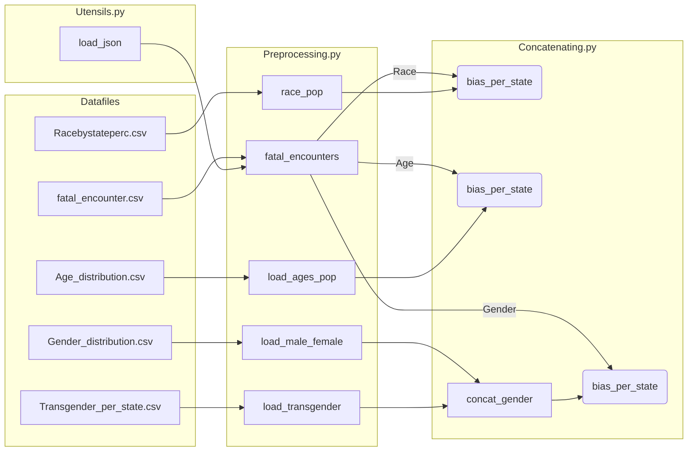
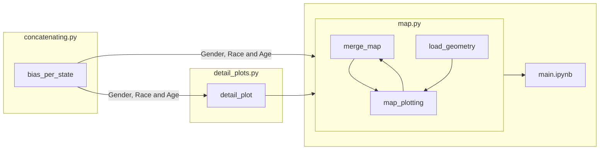

# Police Bias visualisation

This is an interactive map-plot of the United States of America, attempting to illustrate 
police bias in fatal encounters based on race, gender and age of the victim.

## Requirements

Required python packages:

    - pandas
    - geopandas 
    - os.path
    - bokeh
Required Markdown add-on:
    
    - mermaid

## Structure

All files are run from the main.ipynb.

Project structure is as follows:

    - main.ipynb
    - scripts
        - concatenating.py
        - detail_plots.py
        - map.py
        - preprocessing.py
        - show.py
        - utensils.py
    - Data
        - Geometry
            - shapefiles
        - raw datafiles

## Operating instuctions

Open main.ipynb in jupyter notebook. Run all cells.

## Project Pipeline

### 1. Data Processing

### 2. Plotting

    
## Scripts

Descriptions of all functions in all files follow.

### Preprocessing.py

Loading and wrangling of datafiles for concatenating.py.

- **fatal_encounters(filter_var: str)**
    - Preprocessing of the Fatal Encounters (FE) Dataset.
    - Source: https://www.kaggle.com/konradb/fatal-encounters-database
    This takes the dataset from csv to percentages of FE per race in each state.
  
    Steps include:

        1. Loading of CSV
        2. Cleaning Data of irregularities
        3. Adding a column of state abbreviations
        4. Converting absolute number of FE to percentages, split by filter_var and state
    
  - :param filter_var: additional Column that is used to group data besides state (e.g. Gender, Race, Age)
    
  - :rtype: pandas Dataframe
    
  - :return: Percentages of Fatal encounters split by race and state

- **race_pop()**
    - Preprocessing of the race population dataset.
    Loading and transforming the Dataset into that describe
    the percentage of the population for a specific race and state.
    - Source: https://www.census.gov/data/datasets/time-series/demo/popest/2010s-national-detail.html
    
    - :rtype: Pd Dataframe
    
    - :return: DF with columns: State, Race, Proportion_pop

- **load_male_female()**

    - load the dataset on state-wise male female gender distribution
    - Source: https://www.kff.org/other/state-indicator/distribution-by-sex/?currentTimeframe=0&sortModel=%7B%22colId%22:%22Location%22,%22sort%22:%22asc%22%7D
   
    - :return: dataset with the male_female percentages per state

- **load_transgender()**

    load the dataset on state-wise transgender distribution
    - Source: https://williamsinstitute.law.ucla.edu/wp-content/uploads/Trans-Adults-US-Aug-2016.pdf
    - :rtype: dataset with the transgender percentages per state

- **load_ages_pop(include_total: bool)**

    Loading and transforming the state-wise age distribution dataset.
    Calculating percentages per age in every state.
    - Source:https://www.census.gov/data/tables/time-series/demo/popest/2010s-state-detail.html
    - :param include_total: If True the datset will include state-wise totals: age == 999
    - :return: transformed pandas dataframe stacked by state.

### Concatenating.py

- **bias_per_state(fatal_encounters_df, population_percentage_df, filter_var: str)**

    Calculate bias in percent deviation from expected value.
    Specifically, Bias =
    expected FE proportion based on population characteristics per state - actual FE proportion.
    - :param fatal_encounters_df: takes in DF returned by preprocessing.fatal_encounters()
    - :param population_percentage_df: takes in DF returned by preprocessing.population_percentage()
    - :param filter_var: either gender or race or age
    - :rtype: pandas.Dataframe
    - :return: DF with columns: State, Abbrv, Race, Percent_FE, Proportion_pop, bias, Abbr

- **concat_gender_pop(male_female_df, transgender_df)**

    Concatenate the male_female data with the transgender dataset.
    Transgender, Male and Female data is adjusted equally.
    - :param male_female_df: preprocessing.male_female()
    - :param transgender_df: preprocessing.transgender
    - :return: Adjusted population data for all genders in the fatal encounter dataset.

### detail_plots.py

- **detail_plot(my_state: str)**

    Generating the "detail plots" for a selected state.
    Plotting race, gender and age bias in separate bar charts.
    Returning a row layout item for bokeh.
    - :param my_state: Name of selected state
    - :return: Bokeh row object of three bar chars.

### utensils.py

- **load_json(filename):**
    
    Import json from folder "Data" and return as a dictionary.
    - :param filename: name of the json (e.g. example.json
    - :rtype dictionary
    - :return: dictionary of json
  
### show.py

Note: This function is only necessary to display output in the main.ipynb.
It is not part of the data pipeline.

- **show_file(filename, separator=';', columns=None)**

    Load a csv file as DataFrame in the notebook.
    - :param filename: The file that should be loaded
    - :param separator: The separator this CSV uses
    - :param columns: A selection of columns. If left blank, select all columns.
    - :return: pd.DataFrame of the CSV

### map.py

- **load_geometry()**
    
    Load the shapefile to be able to plot a map of the U.S.
    - :return: GeoDataFrame

- **merge_map(maptype_df, filter_var, your_filter_var)**
    
    Create source data for the map.
    This function first merges the geometry data from the shapefile
    with a selected characteristic (Race, Gender or Age). Then it selects the user's characteristic (e.g. Black).
    - :type maptype_df: geopandas DF / output of load_geometry()  (e.g. Race, Gender or Age)
    - :param your_filter_var: Own characteristic (e.g. Black, Female, 25 )
    - :return: Geopandas dataframe of the map to be plotted.

- **map_plotting(doc)**
  
    Main plotting function. Plots map of the United States, adds interactive features,
    integrates detail bar-plots.
    - :param doc: allows to be shown in ipynb with show()
    
## Data

- **Abbrv_to_State.json & State_to_Abbrv.json**
  
  Links state-names with their respective abbreviation.
    _Source:_ https://gist.github.com/mshafrir/2646763

- **Age_distribution.csv**
  
  U.S. population distribution data for age.
    _Source:_ https://www.census.gov/data/tables/time-series/demo/popest/2010s-state-detail.html

- **fatal_encounter.csv**

  Detailed record of fatal police encounters in the U.S.
    _Source:_ https://www.kaggle.com/konradb/fatal-encounters-database

- **Gender_distribution.csv**

  Population distribution data for male and female genders in the U.S for all states.
    _Source:_ https://www.kff.org/other/state-indicator/distribution-by-sex/?currentTimeframe=0&sortModel=%7B%22colId%22:%22Location%22,%22sort%22:%22asc%22%7D

- **Geometry**

  Collection of shapefiles indicating cartographic outlines of all U.S. states.
    _Source:_ https://www.census.gov/geographies/mapping-files/time-series/geo/carto-boundary-file.html

- **Racebystateperc.csv**

  Population distribution data for different races in the U.S. for all states.
    _Source:_ https://www.census.gov/data/datasets/time-series/demo/popest/2010s-national-detail.html

- **Transgender_per_state.csv**

  Population distribution data for transgender people in the U.S. for all states.
    _Source:_ https://williamsinstitute.law.ucla.edu/wp-content/uploads/Trans-Adults-US-Aug-2016.pdf

## Liscense

[MIT](https://choosealicense.com/licenses/mit/)
